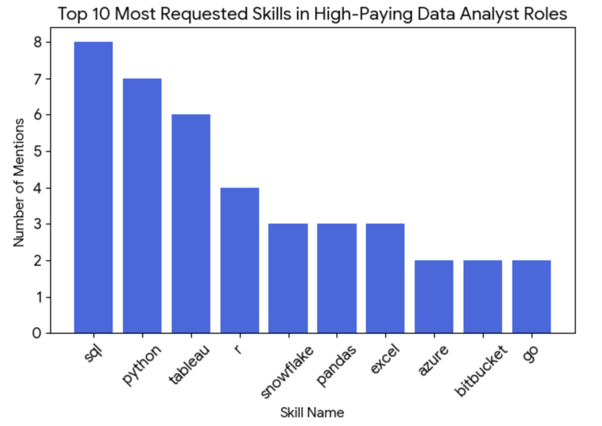

# Introduction
This project provides a comprehensive review of the data job market, with a special focus on Data Analyst roles. It identifies top-paying jobs, the most in-demand skills, and cross-examines both to answer a key question: which skills offer high demand and high salaries in the data analytics field?

Check out the SQL queries: [project_sql folder](/project_sql/)

# Background
This project was created with the objective of providing a clearer understanding of the data analyst job market. The idea behind it was to generate useful insights for myself and for other professionals who are interested in transitioning into this field, while addressing key questions such as the most in-demand skills and the salaries associated with them.

The data used for this analysis comes from [Luke Barousse’s SQL Course](/https://www.lukebarousse.com/sql/), which includes comprehensive information on job titles, salaries, locations, and required skills.

The main questions answered through SQL analysis were:

1. What are the top-paying data analyst jobs available remotely?
2. What skills are required for these top-paying jobs?
3. What skills are most in demand for data analysts?
4. Which skills are associated with higher salaries?
5. What are the most optimal skills to learn (high demand and high-paying)?

# Tools I Used
To analyze the data and answer the key questions in this project, the following tools were used: 
- **SQL:** Used to query, filter, aggregate, and analyze the job market data to uncover trends in salaries and in-demand skills.
- **PostgreSQL:** Served as the database management system for storing and querying the dataset.
- **Visual Studio Code:** Used as the primary development environment for writing and managing SQL queries.
- **Git & GitHub:** Used for version control and to document and share the project.

# The Analysis
Each query in this project was designed to identify specific aspects of the data analyst job market. Below is an explanation of how each question was approached.

### 1. Top-paying Data Analyst Roles

To identify the top-paying data analyst roles, I filtered job postings by average yearly salary and location, with a focus on remote positions. The results highlight the highest-paying opportunities within the data analytics field.

```sql
SELECT
    job_id,
    job_title,
    job_location,
    job_schedule_type,
    salary_year_avg,
    job_posted_date,
    name AS company_name
FROM 
    job_postings_fact
LEFT JOIN company_dim ON job_postings_fact.company_id = company_dim.company_id  
WHERE
    job_title_short = 'Data Analyst' AND 
    job_location = 'Anywhere' AND
    salary_year_avg IS NOT NULL
ORDER BY
    salary_year_avg DESC
LIMIT 10;
```
To further illustrate this analysis, the key findings are summarized below: 
- **Salary:** There is a wide salary range among the top roles, with the highest-paying position offering an average yearly salary of $650,000, while the lowest pays approximately $184,000.
- **Employers:** A diverse set of employers including Meta, AT&T, and UCLA Healthcare demonstrates strong demand for data analytics roles across multiple industries.
- **Specialization:** The job titles vary significantly, ranging from Data Analyst to Director of Analytics and Principal Data Analyst, as well as more specialized roles such as Data Analyst, Marketing.


*Bar graph visualizing the top 10 highest-paying remote data analyst roles, based on the results of the SQL query; ChatGPT generated this graph from the SQL query results*

### 2. Skills for Top-paying Data Analyst Roles 
To identify the skills associated with top-paying roles, I joined multiple tables using a common column to extract skill names while also retaining the corresponding salary information. To further analyze the companies behind these roles, I joined a third table containing company details in order to include company names in the analysis.

```sql
WITH top_paying_jobs AS (
    SELECT
        job_id,
        job_title,
        salary_year_avg,
        name AS company_name
    FROM 
        job_postings_fact
    LEFT JOIN company_dim ON job_postings_fact.company_id = company_dim.company_id  
    WHERE
        job_title_short = 'Data Analyst' AND 
        job_location = 'Anywhere' AND
        salary_year_avg IS NOT NULL
    ORDER BY
        salary_year_avg DESC
    LIMIT 10
)

SELECT 
    top_paying_jobs.*,
    skills
FROM top_paying_jobs
INNER JOIN skills_job_dim ON top_paying_jobs.job_id = skills_job_dim.job_id
INNER JOIN skills_dim ON skills_job_dim.skill_id = skills_dim.skill_id
ORDER BY
    salary_year_avg DESC;
```

Below is a summary of the key findings from the query results:
- **SQL** leads the chart with 8 mentions, highlighting its importance across high-paying roles.
- **Python** follows with 7 mentions, reinforcing its role as a core analytical skill.
- **Tableau** ranks next with 6 mentions, emphasizing the value of data visualization skills.
- **Additional skills** such as R, Snowflake, Pandas and Excel also show strong demand and remain core requirements even at higher salary levels.


*Bar graph visualizing the top 10 skills in high-paying Data Analyst positions; Gemini generated this graph from the SQL query results*

### 3. Most in-demand Skills for Data Analysts
To identify the most in-demand skills, the query below was used to determine which skills are most frequently requested in Data Analyst job postings, focusing on skills with high demand.

```sql
SELECT 
    skills,
    COUNT(skills_job_dim.job_id) AS demand_count
FROM job_postings_fact
INNER JOIN skills_job_dim ON job_postings_fact.job_id = skills_job_dim.job_id
INNER JOIN skills_dim ON skills_job_dim.skill_id = skills_dim.skill_id
WHERE 
    job_title_short = 'Data Analyst' AND
    job_work_from_home = TRUE
GROUP BY
    skills
ORDER BY
    demand_count DESC
LIMIT 5;
```
Below is a breakdown of the most demanded skills for Data Analyst positions:
- **SQL** leading the chart with 7291 mentions followed by **Excel** with 4611 showing the importance of strong foundational skills in data processing. 
- **Python** also leads the chart emphasizing the importance of technical skills for programming.
- **Tableau and Power BI** also stand out demonstrating the value in data visualization that translates into insights for business decisions. 

| Skill | Demand Count |
| :--- | :--- |
| **SQL** | 7,291 |
| **Excel** | 4,611 |
| **Python** | 4,330 |
| **Tableau** | 3,745 |
| **Power BI** | 2,609 |

*Table of the demand for the top 5 skills in Data Analyst job postings*

### 4. Skills associated with higher salaries
To identify the highest-paying skills, this query calculates the average yearly salary for each role. By joining the skills table, we can group specific skill names with their respective salary to highlight top-paying skills.

```sql
SELECT 
    skills,
    ROUND (AVG(salary_year_avg), 0) AS avg_salary
FROM job_postings_fact
INNER JOIN skills_job_dim ON job_postings_fact.job_id = skills_job_dim.job_id
INNER JOIN skills_dim ON skills_job_dim.skill_id = skills_dim.skill_id
WHERE 
    job_title_short = 'Data Analyst' AND
    salary_year_avg IS NOT NULL AND
    job_work_from_home = TRUE
GROUP BY
    skills
ORDER BY
   avg_salary DESC
LIMIT 25;
```
Below is a summary of the results:
- **Big Data** is the winner: PySpark leads by a significant margin with an average salary of $208,172. This underscores the massive value placed on the ability to process large-scale data.
- **DevOps:** Tools like Bitbucket ($189,155) and GitLab ($154,500) appearing near the top suggest that data professionals who embrace software engineering best practices (version control, CI/CD) command much higher pay.
- **AI & Machine Learning Dominance:** Specialized platforms like Watson and DataRobot both cross the $155k threshold, showing that automation and enterprise AI expertise are highly lucrative.
- **The Python Ecosystem:** Core libraries like Pandas ($151,821) and NumPy ($143,513) remain high-value staples, proving that deep technical proficiency in Python is still a gold mine.

| Skill | Average Salary |
| :--- | :--- |
| **PySpark** | $208,172 |
| **Bitbucket** | $189,155 |
| **Couchbase** | $160,515 |
| **Watson** | $160,515 |
| **DataRobot** | $155,486 |
| **GitLab** | $154,500 |
| **Swift** | $153,750 |
| **Jupyter** | $152,777 |
| **Pandas** | $151,821 |
| **Elasticsearch** | $145,000 |

*Table of the top 10 skills associated with higher salaries*

### 5. Most Optimal Skills to learn (High demand and High-paying)
To pinpoint the most optimal skills this query combines two Common Table Expressions (CTEs). The first CTE captures the frequency of skill demand, while the second calculates the average salary per skill. By joining these two tables, we can identify the specific skills that offer the best salary in the Data Analysis job market.

```sql
WITH skills_demand AS (
SELECT 
    skills_dim.skill_id,
    skills_dim.skills,
    COUNT(skills_job_dim.job_id) AS demand_count
FROM job_postings_fact
INNER JOIN skills_job_dim ON job_postings_fact.job_id = skills_job_dim.job_id
INNER JOIN skills_dim ON skills_job_dim.skill_id = skills_dim.skill_id
WHERE 
    job_title_short = 'Data Analyst' AND
    salary_year_avg IS NOT NULL AND
    job_work_from_home = TRUE
GROUP BY
    skills_dim.skill_id
), average_salary AS (
SELECT 
    skills_dim.skill_id,
    ROUND (AVG(salary_year_avg), 0) AS avg_salary
FROM job_postings_fact
INNER JOIN skills_job_dim ON job_postings_fact.job_id = skills_job_dim.job_id
INNER JOIN skills_dim ON skills_job_dim.skill_id = skills_dim.skill_id
WHERE 
    job_title_short = 'Data Analyst' AND
    salary_year_avg IS NOT NULL AND
    job_work_from_home = TRUE
GROUP BY
    skills_dim.skill_id
)

SELECT
    skills_demand.skill_id,
    skills_demand.skills,
    demand_count,
    avg_salary
FROM 
    skills_demand 
INNER JOIN average_salary ON skills_demand.skill_id = average_salary.skill_id
WHERE
    demand_count > 10
ORDER BY
    avg_salary DESC,
    demand_count DESC
LIMIT 25;
```
The summary of this result are order by higher salary showing the following: 
- **The Cloud:** Cloud-based platforms and data warehouses are the most consistent high-earners. **Snowflake** ($112,948), **Azure** ($111,225), and **AWS** ($108,317) all sit comfortably in the top 10, showing that companies are investing heavily in scalable infrastructure.

- **Specialization pays more than popularit:y** While **Python** has the highest overall demand (236 mentions), it ranks lower in salary ($101,397) compared to niche languages like **Go ($115,320)** and **Java ($106,906)**. This suggests that specialized software engineering skills within a data context are highly lucrative.

- **Legacy & modern data engineering:** Both traditional ETL tools like **SSIS** ($106,683) and "Big Data" staples like **Hadoop** ($113,193) remain high-value skills, proving that the ability to move and manage large data pipelines is still a top priority for employers.

- **Operational excellence:** Interestingly, collaboration and project management tools like **Confluence** ($114,210) and **Jira** ($104,918) appear in the top 10. This indicates that at higher salary tiers, the ability to work within structured, enterprise-level workflows is just as important as technical coding ability.

| Skill | Demand Count | Average Salary |
| :--- | :--- | :--- |
| **Go** | 27 | $115,320 |
| **Confluence** | 11 | $114,210 |
| **Hadoop** | 22 | $113,193 |
| **Snowflake** | 37 | $112,948 |
| **Azure** | 34 | $111,225 |
| **BigQuery** | 13 | $109,654 |
| **AWS** | 32 | $108,317 |
| **Java** | 17 | $106,906 |
| **SSIS** | 12 | $106,683 |
| **Jira** | 20 | $104,918 |

*Table of the top 10 skills with its demand count an associated salary* 

# What I learned
- **Complex Query creation:** Mastered the art of building advanced SQL queries that bridge multiple tables and utilize Common Table Expressions (CTEs) to organize complex logic into readable, temporary result sets.
- **Data Aggregation:** Proficiency in using GROUP BY and aggregate functions like COUNT() and AVG() to transform thousands of rows of raw data into summary statistics.
- **Analytical thinking:** Developed the ability to translate "big picture" business questions into precise SQL code, ensuring that the resulting data directly answers real-world market questions.

# Conclusions
### Insights
1. **What are the top-paying data analyst jobs available remotely?**
The market for remote data analysts is incredibly lucrative, with salaries reaching as high as $650,000. The analysis shows that top-tier companies are willing to pay a massive premium for senior-level talent, regardless of their physical location.

2. **What skills are required for these top-paying jobs?**
High-paying roles aren't just looking for basics. They require a mastery of SQL combined with specialized tools. Proficiency in managing complex data structures and the ability to work within enterprise environments are common threads among roles offering the highest compensation.

3. **What skills are most in demand for data analysts?**
SQL reigns supreme as the most demanded skill in the job market, followed closely by Python and Tableau. These three form the "core trinity" of data analytics, appearing in the majority of job postings and making them essential for any job seeker.

4. **Which skills are associated with higher salaries?**
Beyond the standard tools, niche technical skills like SVN, Solidity, and PySpark are associated with the highest average salaries. This indicates that the market rewards specialists who can handle specific technologies or decentralized platforms with a significant financial premium.

5. **What are the most optimal skills to learn?**
The most "optimal" skills, those that sit at the intersection of high demand and high pay, are SQL, Snowflake, and Azure. Mastering these provides the best ROI, offering both high job security and a top-tier salary. 
### Closing thoughts 
This project not only deepened my technical SQL proficiency but also provided a roadmap of the job market. The findings serve as a strategic guide for prioritizing skill development. By focusing on the intersection of high demand and high salary, aspiring analysts can navigate the competitive landscape with confidence. Ultimately, this exploration underscores that in the world of data, continuous learning and adapting to emerging niche trends are the keys to success.