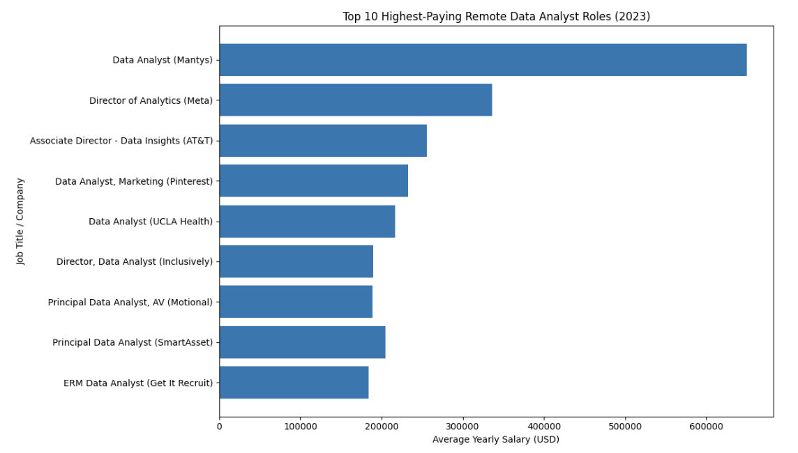

# Introduction
This project provides a comprehensive review of the data job market, with a special focus on Data Analyst roles. It identifies top-paying jobs, the most in-demand skills, and cross-examines both to answer a key question: which skills offer high demand and high salaries in the data analytics field?

Check out the SQL queries: [project_sql folder](/project_sql/)

# Background
This project was created with the objective of providing a clearer understanding of the data analyst job market. The idea behind it was to generate useful insights for myself and for other professionals who are interested in transitioning into this field, while addressing key questions such as the most in-demand skills and the salaries associated with them.

The data used for this analysis comes from [Luke Barousse’s SQL Course](/https://www.lukebarousse.com/sql/), which includes comprehensive information on job titles, salaries, locations, and required skills.

The main questions answered through SQL analysis were:

1. What are the top-paying data analyst jobs available remotely?
2. What skills are required for these top-paying jobs?
3. What skills are most in demand for data analysts?
4. Which skills are associated with higher salaries?
5. What are the most optimal skills to learn (high demand and high-paying)?

# Tools I Used
To analyze the data and answer the key questions in this project, the following tools were used: 
- **SQL:** Used to query, filter, aggregate, and analyze the job market data to uncover trends in salaries and in-demand skills.
- **PostgreSQL:** Served as the database management system for storing and querying the dataset.
- **Visual Studio Code:** Used as the primary development environment for writing and managing SQL queries.
- **Git & GitHub:** Used for version control and to document and share the project.

# The Analysis
Each query in this project was designed to identify specific aspects of the data analyst job market. Below is an explanation of how each question was approached.

### 1. Top-paying Data Analyst Roles

To identify the top-paying data analyst roles, I filtered job postings by average yearly salary and location, with a focus on remote positions. The results highlight the highest-paying opportunities within the data analytics field.

```sql
SELECT
    job_id,
    job_title,
    job_location,
    job_schedule_type,
    salary_year_avg,
    job_posted_date,
    name AS company_name
FROM 
    job_postings_fact
LEFT JOIN company_dim ON job_postings_fact.company_id = company_dim.company_id  
WHERE
    job_title_short = 'Data Analyst' AND 
    job_location = 'Anywhere' AND
    salary_year_avg IS NOT NULL
ORDER BY
    salary_year_avg DESC
LIMIT 10;
```
To further illustrate this analysis, the key findings are summarized below: 
- Salary: There is a wide salary range among the top roles, with the highest-paying position offering an average yearly salary of $650,000, while the lowest pays approximately $184,000.
- Companies: A diverse set of employers including Meta, AT&T, and UCLA Healthcare demonstrates strong demand for data analytics roles across multiple industries.
- Specialization: The job titles vary significantly, ranging from Data Analyst to Director of Analytics and Principal Data Analyst, as well as more specialized roles such as Data Analyst, Marketing.


*Bar graph visualizing the top 10 highest-paying remote data analyst roles, based on the results of the SQL query; ChatGPT generated this graph from the SQL query results*

### 2. Skills for Top-paying Data Analyst Roles 
To identify the skills associated with top-paying roles, I joined multiple tables using a common column to extract skill names while also retaining the corresponding salary information. To further analyze the companies behind these roles, I joined a third table containing company details in order to include company names in the analysis.

```sql
WITH top_paying_jobs AS (
    SELECT
        job_id,
        job_title,
        salary_year_avg,
        name AS company_name
    FROM 
        job_postings_fact
    LEFT JOIN company_dim ON job_postings_fact.company_id = company_dim.company_id  
    WHERE
        job_title_short = 'Data Analyst' AND 
        job_location = 'Anywhere' AND
        salary_year_avg IS NOT NULL
    ORDER BY
        salary_year_avg DESC
    LIMIT 10
)

SELECT 
    top_paying_jobs.*,
    skills
FROM top_paying_jobs
INNER JOIN skills_job_dim ON top_paying_jobs.job_id = skills_job_dim.job_id
INNER JOIN skills_dim ON skills_job_dim.skill_id = skills_dim.skill_id
ORDER BY
    salary_year_avg DESC;
```

Below is a summary of the key findings from the query results:
- **SQL** leads the chart with 8 mentions, highlighting its importance across high-paying roles.
- **Python** follows with 7 mentions, reinforcing its role as a core analytical skill.
- **Tableau** ranks next with 6 mentions, emphasizing the value of data visualization skills.
- **Additional skills** such as R, Snowflake, Pandas and Excel also show strong demand and remain core requirements even at higher salary levels.


# What I learned

# Conclusions
