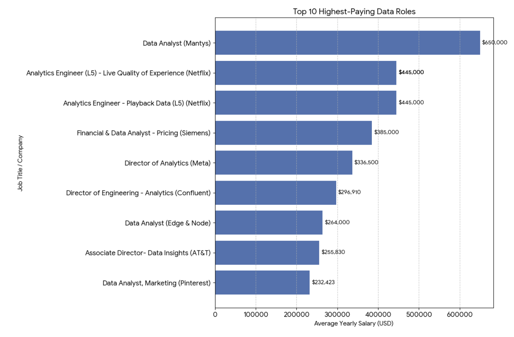
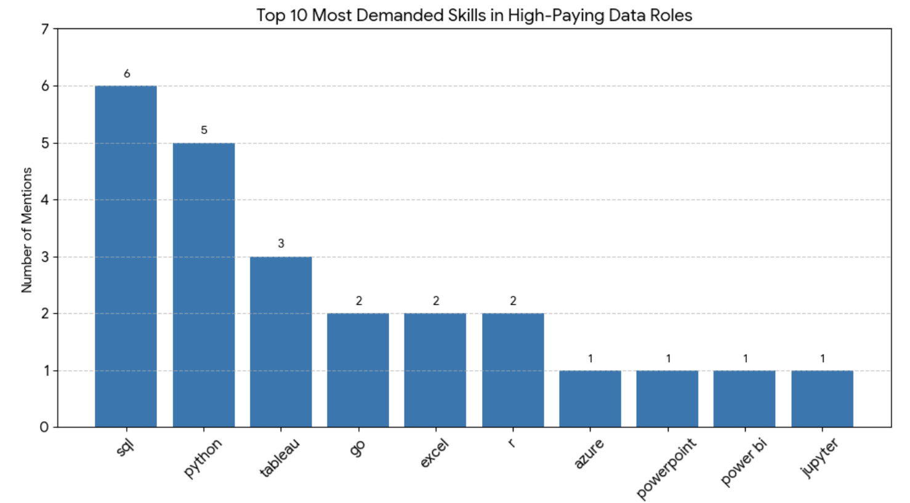

**Data updated: This project now includes the latest available data. The dataset was last refreshed on January 20, 2026.**

# Introduction
This project provides a comprehensive review of the data job market, with a special focus on Data Analyst roles. It identifies top-paying jobs, the most in-demand skills, and cross-examines both to answer a key question: which skills offer high demand and high salaries in the data analytics field?

Check out the SQL queries: [project_sql folder](/project_sql/)

# Background
This project was created with the objective of providing a clearer understanding of the data analyst job market. The idea behind it was to generate useful insights for myself and for other professionals who are interested in transitioning into this field, while addressing key questions such as the most in-demand skills and the salaries associated with them.

The data used for this analysis comes from [Luke Barousse’s SQL Course](/https://www.lukebarousse.com/sql/), which includes comprehensive information on job titles, salaries, locations, and required skills.

The main questions answered through SQL analysis were:

1. What are the top-paying data analyst jobs available remotely?
2. What skills are required for these top-paying jobs?
3. What skills are most in demand for data analysts?
4. Which skills are associated with higher salaries?
5. What are the most optimal skills to learn (high demand and high-paying)?

# Tools I Used
To analyze the data and answer the key questions in this project, the following tools were used: 
- **SQL:** Used to query, filter, aggregate, and analyze the job market data to uncover trends in salaries and in-demand skills.
- **PostgreSQL:** Served as the database management system for storing and querying the dataset.
- **Visual Studio Code:** Used as the primary development environment for writing and managing SQL queries.
- **Git & GitHub:** Used for version control and to document and share the project.

# The Analysis
Each query in this project was designed to identify specific aspects of the data analyst job market. Below is an explanation of how each question was approached.

### 1. Top-paying Data Analyst Roles

To identify the top-paying data analyst roles, I filtered job postings by average yearly salary and location, with a focus on remote positions. The results highlight the highest-paying opportunities within the data analytics field.

```sql
SELECT
    job_id,
    job_title,
    job_location,
    job_schedule_type,
    salary_year_avg,
    job_posted_date,
    name AS company_name
FROM 
    job_postings_fact
LEFT JOIN company_dim ON job_postings_fact.company_id = company_dim.company_id  
WHERE
    job_title_short = 'Data Analyst' AND 
    job_location = 'Anywhere' AND
    salary_year_avg IS NOT NULL
ORDER BY
    salary_year_avg DESC
LIMIT 10;
```
To further illustrate this analysis, the key findings are summarized below: 
- **Salary:** There is a wide salary range among the top roles, with the highest-paying position offering an average yearly salary of $650,000, while the lowest pays approximately $232,000.
- **Employers:** A diverse set of employers including Netflix, Siemens, and Meta demonstrates strong demand for data analytics roles across multiple industries.
- **Specialization:** The job titles vary significantly, ranging from Data Analyst to Analytics Engineer and Director of Analytics, as well as more specialized roles such as Data Analyst, Marketing and Financial & Data Analyst.


*Bar graph visualizing the top 10 highest-paying remote data analyst roles, based on the results of the SQL query; Gemini generated this graph from the SQL query results*

### 2. Skills for Top-paying Data Analyst Roles 
To identify the skills associated with top-paying roles, I joined multiple tables using a common column to extract skill names while also retaining the corresponding salary information. To further analyze the companies behind these roles, I joined a third table containing company details in order to include company names in the analysis.

```sql
WITH top_paying_jobs AS (
    SELECT
        job_id,
        job_title,
        salary_year_avg,
        name AS company_name
    FROM 
        job_postings_fact
    LEFT JOIN company_dim ON job_postings_fact.company_id = company_dim.company_id  
    WHERE
        job_title_short = 'Data Analyst' AND 
        job_location = 'Anywhere' AND
        salary_year_avg IS NOT NULL
    ORDER BY
        salary_year_avg DESC
    LIMIT 10
)

SELECT 
    top_paying_jobs.*,
    skills
FROM top_paying_jobs
INNER JOIN skills_job_dim ON top_paying_jobs.job_id = skills_job_dim.job_id
INNER JOIN skills_dim ON skills_job_dim.skill_id = skills_dim.skill_id
ORDER BY
    salary_year_avg DESC;
```

Below is a summary of the key findings from the query results:
- **SQL** leads the chart with 6 mentions, highlighting its importance across high-paying roles.
- **Python** follows with 5 mentions, reinforcing its role as a core analytical skill.
- **Tableau** ranks next with 3 mentions, emphasizing the value of data visualization skills.
- **Additional skills** such as Go, Excel and R also show strong demand and remain core requirements even at higher salary levels.


*Bar graph visualizing the top 10 skills in high-paying Data Analyst positions; Gemini generated this graph from the SQL query results*

### 3. Most in-demand Skills for Data Analysts
To identify the most in-demand skills, the query below was used to determine which skills are most frequently requested in Data Analyst job postings, focusing on skills with high demand.

```sql
SELECT 
    skills,
    COUNT(skills_job_dim.job_id) AS demand_count
FROM job_postings_fact
INNER JOIN skills_job_dim ON job_postings_fact.job_id = skills_job_dim.job_id
INNER JOIN skills_dim ON skills_job_dim.skill_id = skills_dim.skill_id
WHERE 
    job_title_short = 'Data Analyst' AND
    job_work_from_home = TRUE
GROUP BY
    skills
ORDER BY
    demand_count DESC
LIMIT 5;
```
Below is a breakdown of the most demanded skills for Data Analyst positions:
- **SQL** remains the undisputed king of data analysis, appearing in over 16,000 job listings.
- **Python** and **Excel** are nearly neck-and-neck, highlighting the balance between traditional spreadsheet tools and programmatic data science.
- **Tableau** leads the visualization category, though **Power BI** maintains a strong presence as a primary requirement.

| Skill | Demand Count (Job Postings) |
| :--- | :--- |
| **SQL** | 16,082 |
| **Python** | 10,386 |
| **Excel** | 9,849 |
| **Tableau** | 8,704 |
| **Power BI** | 6,300 |

*Table of the demand for the top 5 skills in Data Analyst job postings*

### 4. Skills associated with higher salaries
To identify the highest-paying skills, this query calculates the average yearly salary for each role. By joining the skills table, we can group specific skill names with their respective salary to highlight top-paying skills.

```sql
SELECT 
    skills,
    ROUND (AVG(salary_year_avg), 0) AS avg_salary
FROM job_postings_fact
INNER JOIN skills_job_dim ON job_postings_fact.job_id = skills_job_dim.job_id
INNER JOIN skills_dim ON skills_job_dim.skill_id = skills_dim.skill_id
WHERE 
    job_title_short = 'Data Analyst' AND
    salary_year_avg IS NOT NULL AND
    job_work_from_home = TRUE
GROUP BY
    skills
ORDER BY
   avg_salary DESC
LIMIT 25;
```
Below is a summary of the results:
- **Modern Web Integration**: The high salaries for **TypeScript** and **GraphQL** suggest a trend where data analysts are increasingly expected to integrate directly with application front-ends and modern API layers.
- **DevOps & Infrastructure**: Tools like **Bitbucket**, **Kubernetes**, and **Shell** command high premiums, reflecting the value of "DataOps"—applying software engineering best practices to data pipelines.
- **Specialized Processing**: Big data tools like **PySpark** and **Scala** continue to be high-earning pillars for analysts handling large-scale distributed data.

| Skill | Average Salary (USD) |
| :--- | :--- |
| **TypeScript** | **$445,000** |
| **GraphQL** | **$264,000** |
| **Bitbucket** | **$189,155** |
| Trello | $171,396 |
| Node | $170,813 |
| PySpark | $161,971 |
| Couchbase | $160,515 |
| Perl | $158,000 |
| DataRobot | $155,486 |
| Swift | $153,750 |
| Atlassian | $152,145 |
| Scala | $152,052 |
| Watson | $147,758 |
| Elasticsearch | $145,000 |
| Kubernetes | $141,985 |
| Zoom | $139,029 |
| Splunk | $130,000 |
| Asana | $128,538 |
| Notion | $125,000 |
| Jira | $123,447 |
| Unreal | $120,000 |
| Shell | $119,058 |
| Go | $118,753 |
| Databricks | $117,633 |
| C | $117,469 |

*Table of the top 25 skills associated with higher salaries.*

### 5. Most Optimal Skills to learn (High demand and High-paying)
To pinpoint the most optimal skills this query combines two Common Table Expressions (CTEs). The first CTE captures the frequency of skill demand, while the second calculates the average salary per skill. By joining these two tables, we can identify the specific skills that offer the best salary in the Data Analysis job market.

```sql
WITH skills_demand AS (
SELECT 
    skills_dim.skill_id,
    skills_dim.skills,
    COUNT(skills_job_dim.job_id) AS demand_count
FROM job_postings_fact
INNER JOIN skills_job_dim ON job_postings_fact.job_id = skills_job_dim.job_id
INNER JOIN skills_dim ON skills_job_dim.skill_id = skills_dim.skill_id
WHERE 
    job_title_short = 'Data Analyst' AND
    salary_year_avg IS NOT NULL AND
    job_work_from_home = TRUE
GROUP BY
    skills_dim.skill_id
), average_salary AS (
SELECT 
    skills_dim.skill_id,
    ROUND (AVG(salary_year_avg), 0) AS avg_salary
FROM job_postings_fact
INNER JOIN skills_job_dim ON job_postings_fact.job_id = skills_job_dim.job_id
INNER JOIN skills_dim ON skills_job_dim.skill_id = skills_dim.skill_id
WHERE 
    job_title_short = 'Data Analyst' AND
    salary_year_avg IS NOT NULL AND
    job_work_from_home = TRUE
GROUP BY
    skills_dim.skill_id
)

SELECT
    skills_demand.skill_id,
    skills_demand.skills,
    demand_count,
    avg_salary
FROM 
    skills_demand 
INNER JOIN average_salary ON skills_demand.skill_id = average_salary.skill_id
WHERE
    demand_count > 10
ORDER BY
    avg_salary DESC,
    demand_count DESC
LIMIT 25;
```
The summary of this result are order by higher salary showing the following: 

- **The "Big Three"**: **SQL**, **Python**, and **Tableau** offer the best balance of high demand and strong salaries, all hovering near or above the $100k mark.
- **Premium Technical Skills**: While **Snowflake**, **Oracle**, and **Jira** have lower total demand counts, they command significantly higher average salaries, suggesting specialized roles or senior-level requirements.
- **The Tools Gap**: Standard office tools like **Excel** and **Word** have high demand but are associated with the lower end of the salary spectrum compared to programmatic or cloud-based tools.

| Skill | Demand (Job Postings) | Average Salary (USD) |
| :--- | :--- | :--- |
| **SQL** | 820 | $99,217 |
| **Python** | 508 | $98,671 |
| **Tableau** | 500 | $100,093 |
| **Excel** | 467 | $87,975 |
| **R** | 288 | $98,756 |
| Power BI | 280 | $91,958 |
| Looker | 125 | $93,223 |
| SAS | 115 | $93,933 |
| PowerPoint | 102 | $88,645 |
| Word | 99 | $81,557 |
| AWS | 79 | $88,213 |
| **Snowflake** | 78 | **$106,715** |
| Azure | 72 | $99,153 |
| **Oracle** | 70 | **$107,190** |
| **Jira** | 68 | **$123,447** |

*Table of the top 15 skills with its demand count an associated salary* 

# What I learned
- **Complex Query creation:** Mastered the art of building advanced SQL queries that bridge multiple tables and utilize Common Table Expressions (CTEs) to organize complex logic into readable, temporary result sets.
- **Data Aggregation:** Proficiency in using GROUP BY and aggregate functions like COUNT() and AVG() to transform thousands of rows of raw data into summary statistics.
- **Analytical thinking:** Developed the ability to translate "big picture" business questions into precise SQL code, ensuring that the resulting data directly answers real-world market questions.

# Conclusions
### Insights
### 1. What are the top-paying data analyst jobs available remotely?
The market for remote data analysts is incredibly lucrative, with salaries reaching as high as **$650,000**. The analysis indicates that top-tier companies—notably **Netflix**—are willing to pay a massive premium for senior-level talent, regardless of their physical location.

### 2. What skills are required for these top-paying jobs?
High-paying roles demand more than just the basics. While **SQL** and **Python** are fundamental, these roles require a mastery of specialized tools like **TypeScript**, **Go**, and **Scala**. High-compensation roles often bridge the gap between data analysis and software engineering, requiring the ability to manage complex data structures in high-scale environments.

### 3. What skills are most in demand for data analysts?
**SQL** remains the undisputed king of the data market, followed closely by **Python** and **Tableau**. These three form the "core trinity" of data analytics. While **Excel** still holds high demand, the market is shifting heavily toward programmatic and visualization tools that can handle larger, more complex datasets.

### 4. Which skills are associated with higher salaries?
Niche technical skills and DevOps tools command the highest average salaries. **TypeScript** leads the pack, followed by **GraphQL** and **Bitbucket**. This indicates that the market rewards "DataOps" specialists—those who can handle decentralized platforms, API layers, and version control systems alongside traditional data processing.

### 5. What are the most optimal skills to learn?
The "optimal" skills—sitting at the perfect intersection of high demand and high pay—are **SQL**, **Snowflake**, and **Azure**. Mastering these provides the best ROI, offering a combination of high job security and a top-tier salary floor (averaging near or above $100k).

This analysis demonstrates that the data analyst role is evolving. While the "Core Trinity" gets you in the door, the highest financial rewards go to those who can operate at the intersection of data analysis and software engineering.


### Closing thoughts 
This project not only deepened my technical SQL proficiency but also provided a roadmap of the job market. The findings serve as a strategic guide for prioritizing skill development. By focusing on the intersection of high demand and high salary, aspiring analysts can navigate the competitive landscape with confidence. Ultimately, this exploration underscores that in the world of data, continuous learning and adapting to emerging niche trends are the keys to success.